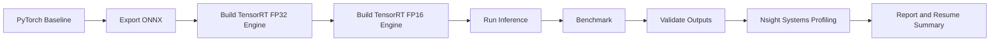

# TensorRT 项目实验报告

## 1. 项目背景

本项目目标是把一个已经训练好的图像分类模型，从 PyTorch 推理链路完整迁移到 ONNX 和 TensorRT，并完成性能测试、输出一致性验证和 profiling 分析，形成可复现的部署实验闭环。

## 2. 技术路线

## 3. 环境信息

- 操作系统：
- Python 版本：
- GPU 型号：
- CUDA 版本：
- TensorRT 版本：
- PyTorch 版本：
- ONNX Runtime 版本：

可直接引用 `results/raw/environment.json` 中的结果。

## 4. 模型说明

- 模型名称：`ResNet50`
- 任务类型：图像分类
- 输入尺寸：`1x3x224x224`
- 预处理：Resize -> CenterCrop -> Normalize

## 5. ONNX 导出过程

- 导出命令：
- ONNX 文件路径：
- 输入 tensor 名称：
- 输出 tensor 名称：
- 是否使用动态 batch：
- 导出过程中遇到的问题：

## 6. TensorRT Engine 构建过程

### 6.1 FP32

- Engine 路径：
- 构建命令：
- 构建日志：
- 是否成功：

### 6.2 FP16

- Engine 路径：
- 构建命令：
- 构建日志：
- 是否成功：

### 6.3 INT8（可选）

- 是否实现：
- 校准方式：
- 结论：

## 7. Benchmark 设计

- 是否固定输入尺寸：是 / 否
- Batch size：
- Warmup：
- Iterations：
- 是否包含 H2D/D2H：
- 是否使用 `trtexec`：

## 8. 性能结果

将 `results/benchmark_results.csv` 中的数据整理成表格贴到这里。

| Runner | Precision | Batch Size | Mean Latency (ms) | P95 Latency (ms) | Throughput (qps) |
| --- | --- | --- | --- | --- | --- |
| 待填充 | 待填充 | 待填充 | 待填充 | 待填充 | 待填充 |

## 9. 输出一致性验证

将 `results/accuracy_compare.csv` 中的数据整理到这里。

| Compare | Max Abs Diff | Mean Abs Diff | Top1 Agreement | Top5 Overlap |
| --- | --- | --- | --- | --- |
| 待填充 | 待填充 | 待填充 | 待填充 | 待填充 |

## 10. Profiling 结论

- 使用工具：`Nsight Systems`
- 观察到的热点：
- CPU / GPU 时间线特点：
- 数据拷贝是否明显影响总耗时：
- 为什么 TensorRT 更快，或者为什么提升不明显：

## 11. 踩坑记录

### 11.1 ONNX 导出问题

- 问题：
- 原因：
- 解决方案：

### 11.2 TensorRT 构建问题

- 问题：
- 原因：
- 解决方案：

### 11.3 输出不一致问题

- 问题：
- 原因：
- 解决方案：

## 12. 总结与下一步

### 本项目完成了什么

- 完整跑通了 `PyTorch -> ONNX -> TensorRT`
- 对比了至少 `FP32 / FP16` 两种方案
- 做了输出一致性验证
- 做了 benchmark 和 profiling

### 后续可继续扩展

- 加入 INT8 量化
- 支持动态 shape
- 引入 TensorRT C++ Runtime
- 尝试 Triton 部署

## 13. 可直接写进简历的话术

> 基于 PyTorch 完成图像分类模型的 ONNX 导出与 TensorRT 部署，构建 FP32 / FP16 推理 engine，并在统一输入条件下对比不同精度下的延迟、吞吐与输出一致性；结合 profiling 工具分析推理链路瓶颈，完成模型部署、性能测试与优化验证闭环。

